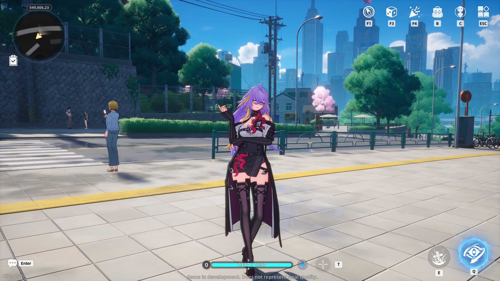

# fadia-rs

##### Experimental server emulator for the game Neverness to Everness



#### NOTE: fadia-rs is currently under active development

## Getting started

### Requirements

- [Rust 1.88+](https://www.rust-lang.org/tools/install)

### Setup

#### building from sources

```sh
git clone https://git.xeondev.com/fadia-rs/fadia-rs.git
cd fadia-rs
cargo run --bin fadia-patchersdk-server
cargo run --bin fadia-gamesdk-server
cargo run --bin fadia-game-server
```

### Logging in

Currently supported client version is `CB2 Global 1.0.19`, you can get it from 3rd party sources (e.g. game launcher). Next, you have to apply the necessary [client patch](https://github.com/2572769996/symphonic). It disables anticheat and allows you to connect to local server.

## Implementation details

- patchersdk-server: implements a basic HTTP file server from which client obtains the "serverlist".
- gamesdk-server: emulates "sdk" server which handles account login and provides the route to the game server.
- game-server: emulates Unreal Engine Dedicated Server, which is used for the entirety of game logic.

## Extra configuration

You can change playable character in the `game_server.toml` file.
